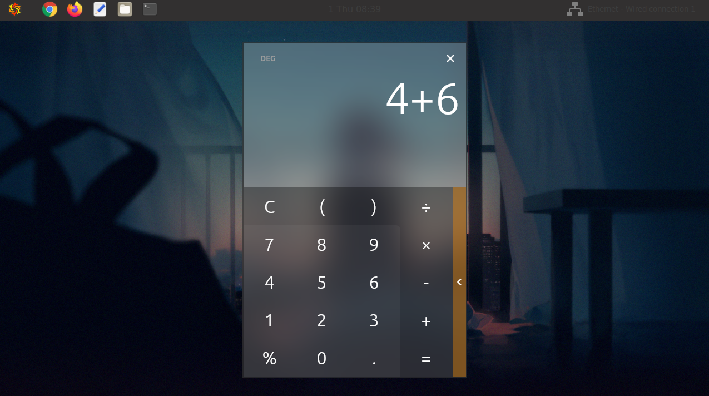

This is small project for Linux and Flutter using transparent gtk window and flutter on top.

If you want to have blurry background you need appropriate compositor with blur function like wayfire

Sample calculator ported from https://github.com/dahliaOS/calculator

Small bug for first repaint, you need to resize it first to reinit flutter painting

